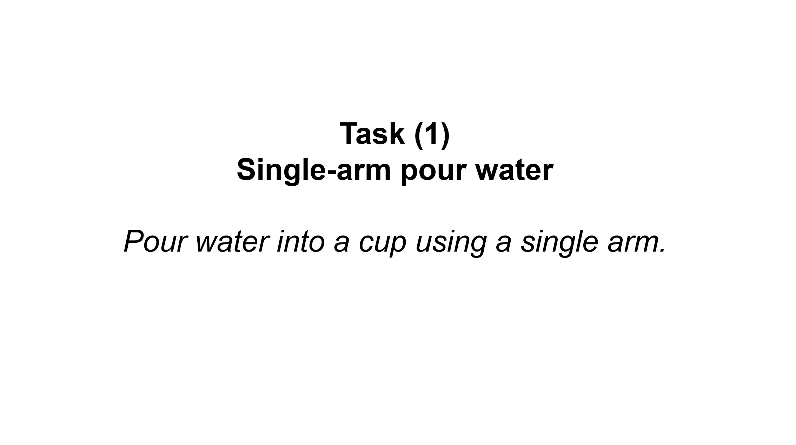

<div align="center">

# From Reaction to Anticipation: Proactive Failure Recovery through Agentic Task Graph for Robotic Manipulation

<p>
  <a href="https://shengxu.net/">Sheng Xu</a><sup>1</sup>,
  <a href="https://openreview.net/profile?id=~Ruixing_Jin1">Ruixing Jin</a><sup>1</sup>,
  <a href="https://hnuzhy.github.io/">Huayi Zhou</a><sup>1</sup>,
  <a href="https://bobyue0118.github.io/">Bo Yue</a><sup>1</sup>,
  <a href="https://github.com/qiaoguanren/qiaoguanren.github.io">Guanren Qiao</a><sup>1</sup>,
  <br/>
  <a href="https://yuecideng.github.io/">Yueci Deng</a><sup>1</sup>,
  Yunxin Tai<sup>2</sup>,
  <a href="https://scholar.google.com/citations?user=Mf9VHRcAAAAJ&hl=en">Kui Jia</a><sup>1,2</sup>,
  <a href="https://guiliang.me/">Guiliang Liu</a><sup>1,3,&dagger;</sup>
</p>

<p>
  <sup>1</sup> The Chinese University of Hong Kong, Shenzhen
  <br/>
  <sup>2</sup> DexForce Technology
  <br/>
  <sup>3</sup> Shenzhen Loop Area Institute
</p>

<p><sup>&dagger;</sup> Corresponding author</p>

<p>
  <a href="https://arxiv.org/abs/2605.11951">[📄 Paper]</a>
  <a href="https://shengxu.net/AgentChord/">[🌐 Project Page]</a>
  <a href="LICENSE">[⚖️ License]</a>
</p>

</div>

<p align="center">
  
</p>

<p align="center">
  <a href="docs/static/demos/video.mp4">
    
  </a>
</p>

<p align="center">
  <a href="docs/static/demos/video.mp4">Watch the overview video</a>
</p>

## Overview

AgentChord is a recovery-aware robotic manipulation system built on top of [EmbodiChain](https://github.com/DexForce/EmbodiChain). Instead of reacting to failures only after execution breaks down, AgentChord anticipates likely disturbance modes before execution, augments a nominal task graph with recovery branches, and compiles both nominal and recovery transitions into an executable graph with online monitors.

<p align="center">
  
</p>

The system is organized around three agentic roles:

- **[Task Structuring Agent](embodichain/agents/hierarchy/task_agent.py)**: builds a nominal directed task graph from the task instruction and scene observations.
- **[Recovery Orchestration Agent](embodichain/agents/hierarchy/recovery_agent.py)**: predicts likely failures, creates online-detectable triggers, and adds forward-moving recovery branches.
- **[Execution Compilation Agent](embodichain/agents/hierarchy/compile_agent.py)**: compiles node keyframes, edge programs, and monitors into interruptible robot behaviors.

## Release Contents

This repository contains the AgentChord implementation built on the EmbodiChain codebase. The Python package name is still `embodichain`.

Available now:
- [x] Project page source with paper figures and execution videos.
- [x] EmbodiChain simulation and data-generation infrastructure needed to run the system.
- [x] AgentChord hierarchical agents, graph compilation, atomic actions, monitor functions, and runtime execution.
- [x] Simulation configurations and running scripts for three EmbodiChain tasks.

Coming soon:

- [ ] Expand more failure monitor functions and recovery function templates.
- [ ] Real-world running scripts with perception modules for six long-horizon tasks.

## Installation

AgentChord depends on the EmbodiChain runtime, GPU simulation stack, and an LLM endpoint. The recommended platform is Linux with an NVIDIA GPU.

System requirements inherited from EmbodiChain:

| Component | Requirement |
| --- | --- |
| OS | Ubuntu 20.04+ |
| GPU | NVIDIA GPU with compute capability 7.0+ |
| Driver | 535-570 recommended |
| Python | 3.10 or 3.11 |

Install from this repository:

```bash
git clone https://github.com/Jasonxu1225/AgentChord.git
cd AgentChord
pip install -e . --extra-index-url http://pyp.open3dv.site:2345/simple/ --trusted-host pyp.open3dv.site
```

EmbodiChain also provides a Docker workflow for the full simulation stack:

```bash
docker pull dexforce/embodichain:ubuntu22.04-cuda12.8
./docker/docker_run.sh <container_name> <data_path>
```

For more EmbodiChain environment details, see the official documentation:

- [Installation Guide](https://dexforce.github.io/EmbodiChain/main/quick_start/install.html)
- [Quick Start Tutorial](https://dexforce.github.io/EmbodiChain/main/tutorial/index.html)
- [API Reference](https://dexforce.github.io/EmbodiChain/main/api_reference/index.html)

## LLM Setup

AgentChord uses LangChain's `ChatOpenAI` wrapper in `embodichain/agents/hierarchy/llm.py`.

Set the API key and OpenAI-compatible endpoint before running the agent:

```bash
export LLM_URL="https://your-openai-compatible-endpoint/v1/"
export OPENAI_API_KEY="your-api-key"
```

If you use a different model name or proxy, update `embodichain/agents/hierarchy/llm.py` accordingly. The task, recovery, and compile agents are currently initialized with `gpt-5`.

## Running AgentChord

Run commands from the repository root. The following command reproduces a single-arm pour-water rollout with proactive recovery and terminal-triggered error injection:

```bash
python embodichain/lab/scripts/run_agent.py \
  --gym_config configs/gym/agent/pour_water_agent/fast_gym_config.json \
  --agent_config configs/gym/agent/pour_water_agent/agent_config.json \
  --task_name SinglePourWater \
  --filter_dataset_saving \
  --filter_visual_rand \
  --recovery \
  --interactive_error_injection
```

During execution, press `f` in the terminal to inject a failure. The prompt lets you choose `misplaced_object` or `fallen_object`, select the object, and enter a relative disturbance offset.

AgentChord caches the generated task graph, recovery spec, and compiled graph under:

```text
embodichain/database/agent_generated_content/<task_name>/
```

Typical files include:

- `agent_task_graph.json`: nominal graph produced by the Task Structuring Agent.
- `agent_recovery_spec.json`: monitor-to-recovery bindings produced by the Recovery Orchestration Agent.
- `agent_compiled_graph.json`: executable graph bundle used by the runtime.

For the command above, `<task_name>` is `SinglePourWater`. Re-running the same command reuses these files by default; add `--regenerate` when you want to discard the cache and ask the agents to generate fresh artifacts.

Useful flags:

| Flag | Meaning |
| --- | --- |
| `--recovery` | Generate and execute recovery-augmented task graphs. Omit it for nominal graph execution. |
| `--interactive_error_injection` | Enable terminal-triggered object disturbances during execution. |
| `--regenerate` | Regenerate cached files in `embodichain/database/agent_generated_content/<task_name>/`. |
| `--filter_dataset_saving` | Disable dataset saving during quick experiments. |
| `--filter_visual_rand` | Disable visual randomization for cleaner debugging. |
| `--headless` | Run without a simulation window. |
| `--device cuda --gpu_id 0` | Select CUDA execution when your environment is configured for it. |

## Provided Simulation Task Configurations

| Task | Command settings |
| --- | --- |
| Single-arm pour water | `--gym_config configs/gym/agent/pour_water_agent/fast_gym_config.json --agent_config configs/gym/agent/pour_water_agent/agent_config.json --task_name SinglePourWater` |
| Dual-arm pour water | `--gym_config configs/gym/agent/pour_water_agent/fast_gym_config.json --agent_config configs/gym/agent/pour_water_agent/agent_config_dual.json --task_name DualPourWater` |
| Table rearrangement | `--gym_config configs/gym/agent/rearrangement_agent/fast_gym_config.json --agent_config configs/gym/agent/rearrangement_agent/agent_config.json --task_name Rearrangement` |

To run a clean rollout without proactive recovery, remove `--recovery` and `--interactive_error_injection`.

## Citation

If you find AgentChord useful in your research, please cite:

```bibtex
@inproceedings{xu2026agentchord,
  title = {From Reaction to Anticipation: Proactive Failure Recovery through Agentic Task Graph for Robotic Manipulation},
  author = {Xu, Sheng and Jin, Ruixing and Zhou, Huayi and Yue, Bo and Qiao, Guanren and Deng, Yueci and Tai, Yunxin and Jia, Kui and Liu, Guiliang},
  booktitle = {Robotics: Science and Systems (RSS)},
  year = {2026}
}
```

If you find EmbodiChain helpful for your research, please cite:

```bibtex
@misc{EmbodiChain,
  author = {EmbodiChain Developers},
  title = {EmbodiChain: An end-to-end, GPU-accelerated, and modular platform for building generalized Embodied Intelligence},
  month = {November},
  year = {2025},
  url = {https://github.com/DexForce/EmbodiChain}
}
```
