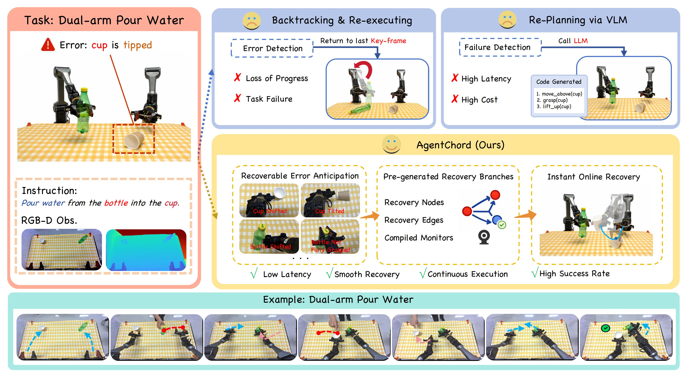
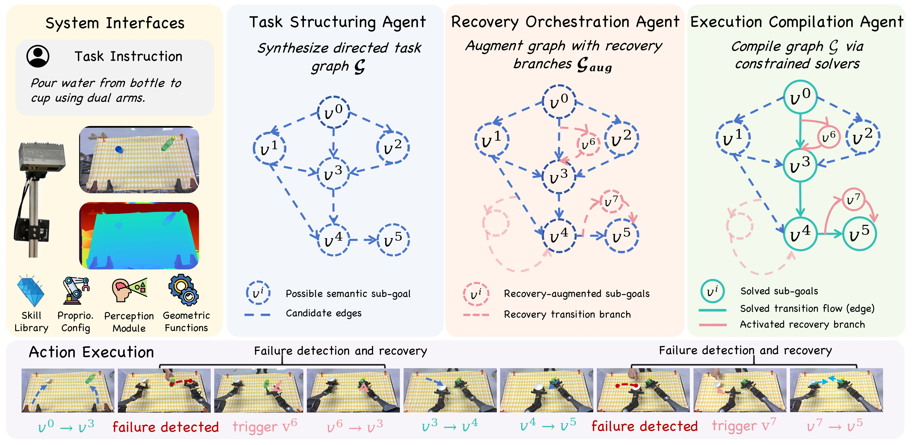

<div align="center">

# From Reaction to Anticipation: Proactive Failure Recovery through Agentic Task Graph for Robotic Manipulation

<p><strong>Robotics: Science and Systems (RSS) 2026</strong></p>

<p>
  <a href="https://shengxu.net/">Sheng Xu</a><sup>1</sup>,
  <a href="https://openreview.net/profile?id=~Ruixing_Jin1">Ruixing Jin</a><sup>1</sup>,
  <a href="https://hnuzhy.github.io/">Huayi Zhou</a><sup>1</sup>,
  <a href="https://bobyue0118.github.io/">Bo Yue</a><sup>1</sup>,
  <a href="https://github.com/qiaoguanren/qiaoguanren.github.io">Guanren Qiao</a><sup>1</sup>,
  <br/>
  <a href="https://yuecideng.github.io/">Yueci Deng</a><sup>1</sup>,
  Yunxin Tai<sup>2</sup>,
  <a href="https://scholar.google.com/citations?user=Mf9VHRcAAAAJ&hl=en">Kui Jia</a><sup>1,2</sup>,
  <a href="https://guiliang.me/">Guiliang Liu</a><sup>1,3,&dagger;</sup>
</p>

<p>
  <sup>1</sup> The Chinese University of Hong Kong, Shenzhen
  <br/>
  <sup>2</sup> DexForce Technology
  <br/>
  <sup>3</sup> Shenzhen Loop Area Institute
</p>

<p><sup>&dagger;</sup> Corresponding author</p>

<p>
  <a href="https://arxiv.org/abs/2605.11951">[📄 Paper]</a>
  <a href="https://edem-ai.github.io/AgentChord">[🌐 Project Page]</a>
  <a href="LICENSE">[⚖️ License]</a>
</p>

</div>

<p align="center">
  
</p>

## Table of Contents

- **Project**
  - [Overview](#overview)
  - [Release Contents](#release-contents)
- **Setup**
  - [Installation](#installation)
  - [LLM Setup](#llm-setup)
- **Run AgentChord**
  - [Simulation](#running-agentchord-in-simulation)
    - [Simulation Prerequisites](#simulation-prerequisites)
    - [Run a Simulation Rollout](#run-a-simulation-rollout)
    - [Simulation Generated Files](#simulation-generated-files)
    - [Simulation Flags](#simulation-flags)
    - [Provided Simulation Tasks](#provided-simulation-tasks)
  - [Real Robot](#running-agentchord-on-the-real-robot)
    - [Real-Robot Prerequisites](#real-robot-prerequisites)
    - [Bring Up CAN and ROS](#bring-up-can-and-ros)
    - [Run the Real-World Agent](#run-the-real-world-agent)
    - [Real-World Generated Files](#real-world-generated-files)
    - [Real-World Flags](#real-world-flags)
- **Reference**
  - [Citation](#citation)

## Overview

AgentChord is a recovery-aware robotic manipulation system built on top of [EmbodiChain](https://github.com/DexForce/EmbodiChain). Instead of reacting to failures only after execution breaks down, AgentChord anticipates likely disturbance modes before execution, augments a nominal task graph with recovery branches, and compiles both nominal and recovery transitions into an executable graph with online monitors.

<p align="center">
  
</p>

The system is organized around three agentic roles:

- **[Task Structuring Agent](embodichain/agents/hierarchy/task_agent.py)**: builds a nominal directed task graph from the task instruction and scene observations.
- **[Recovery Orchestration Agent](embodichain/agents/hierarchy/recovery_agent.py)**: predicts likely failures, creates online-detectable triggers, and adds forward-moving recovery branches.
- **[Execution Compilation Agent](embodichain/agents/hierarchy/compile_agent.py)**: compiles node keyframes, edge programs, and monitors into interruptible robot behaviors.

## Release Contents

This repository contains the AgentChord implementation built on the EmbodiChain codebase. The Python package name is still `embodichain`.

Available now:

- [x] Project page source with paper figures and execution videos.
- [x] AgentChord hierarchical agents, graph compilation, atomic actions, monitor functions, and runtime execution.
- [x] Simulation configurations and running scripts for three EmbodiChain tasks.
- [x] Real-world CobotMagic running script with perception modules.

Coming soon:

- [ ] Expand more failure monitor functions and recovery function templates.

## Installation

AgentChord depends on the EmbodiChain runtime, GPU simulation stack, and an LLM endpoint. The recommended platform is Linux with an NVIDIA GPU.

System requirements inherited from EmbodiChain:

| Component | Requirement |
| --- | --- |
| OS | Ubuntu 20.04+ |
| GPU | NVIDIA GPU with compute capability 7.0+ |
| Driver | 535-570 recommended |
| Python | 3.10 or 3.11 |

Install from this repository:

```bash
git clone https://github.com/EDEM-AI/AgentChord.git
cd AgentChord
pip install -e . --extra-index-url http://pyp.open3dv.site:2345/simple/ --trusted-host pyp.open3dv.site
```

EmbodiChain also provides a Docker workflow for the full simulation stack:

```bash
docker pull dexforce/embodichain:ubuntu22.04-cuda12.8
./docker/docker_run.sh <container_name> <data_path>
```

For more EmbodiChain environment details, see the official documentation:

- [Installation Guide](https://dexforce.github.io/EmbodiChain/main/quick_start/install.html)
- [Quick Start Tutorial](https://dexforce.github.io/EmbodiChain/main/tutorial/index.html)
- [API Reference](https://dexforce.github.io/EmbodiChain/main/api_reference/index.html)

## LLM Setup

AgentChord uses LangChain's `ChatOpenAI` wrapper in `embodichain/agents/hierarchy/llm.py`.

Set the API key and OpenAI-compatible endpoint before running the agent:

```bash
export LLM_URL="https://your-openai-compatible-endpoint/v1/"
export OPENAI_API_KEY="your-api-key"
```

If you use a different model name or proxy, update `embodichain/agents/hierarchy/llm.py` accordingly. The task, recovery, and compile agents are currently initialized with `gpt-5`.

## Running AgentChord in Simulation

The simulation runner executes AgentChord inside EmbodiChain gym environments. It uses simulated robot state, object state, cameras, and disturbance injection while sharing the same task, recovery, and compile agents used by the real-world runner.

### Simulation Prerequisites

Complete [Installation](#installation) and [LLM Setup](#llm-setup) before running simulation. For GPU simulation, make sure the EmbodiChain runtime can access CUDA and your display setup is ready if you are not using `--headless`.

### Run a Simulation Rollout

Run commands from the repository root. The following command reproduces a single-arm pour-water rollout with proactive recovery and terminal-triggered error injection:

```bash
python embodichain/lab/scripts/run_agent.py \
  --gym_config configs/gym/agent/pour_water_agent/fast_gym_config.json \
  --agent_config configs/gym/agent/pour_water_agent/agent_config.json \
  --task_name SinglePourWater \
  --filter_dataset_saving \
  --filter_visual_rand \
  --recovery \
  --interactive_error_injection
```

During execution, press `f` in the terminal to inject a failure. The prompt lets you choose `misplaced_object` or `fallen_object`, select the object, and enter a relative disturbance offset.

### Simulation Generated Files

AgentChord caches the generated task graph, recovery spec, and compiled graph under:

```text
embodichain/database/agent_generated_content/sim/<task_name>/
```

Typical files include:

- `agent_task_graph.json`: nominal graph produced by the Task Structuring Agent.
- `agent_recovery_spec.json`: monitor-to-recovery bindings produced by the Recovery Orchestration Agent.
- `agent_compiled_graph.json`: executable graph bundle used by the runtime.

For the command above, `<task_name>` is `SinglePourWater`. Re-running the same command reuses these files by default; add `--regenerate` when you want to discard the cache and ask the agents to generate fresh artifacts.

### Simulation Flags

Useful flags:

| Flag | Meaning |
| --- | --- |
| `--recovery` | Generate and execute recovery-augmented task graphs. Omit it for nominal graph execution. |
| `--interactive_error_injection` | Enable terminal-triggered object disturbances during execution. |
| `--regenerate` | Regenerate cached files in `embodichain/database/agent_generated_content/sim/<task_name>/`. |
| `--filter_dataset_saving` | Disable dataset saving during quick experiments. |
| `--filter_visual_rand` | Disable visual randomization for cleaner debugging. |
| `--headless` | Run without a simulation window. |
| `--device cuda --gpu_id 0` | Select CUDA execution when your environment is configured for it. |

### Provided Simulation Tasks

| Task | Command settings |
| --- | --- |
| Single-arm pour water | `--gym_config configs/gym/agent/pour_water_agent/fast_gym_config.json --agent_config configs/gym/agent/pour_water_agent/agent_config.json --task_name SinglePourWater` |
| Dual-arm pour water | `--gym_config configs/gym/agent/pour_water_agent/fast_gym_config.json --agent_config configs/gym/agent/pour_water_agent/agent_config_dual.json --task_name DualPourWater` |
| Table rearrangement | `--gym_config configs/gym/agent/rearrangement_agent/fast_gym_config.json --agent_config configs/gym/agent/rearrangement_agent/agent_config.json --task_name Rearrangement` |

To run a clean rollout without proactive recovery, remove `--recovery` and `--interactive_error_injection`.

## Running AgentChord on the Real Robot

The real-world runner uses the same task/recovery/compile agents as simulation, but executes the compiled graph through the CobotMagic ROS bridge and obtains object poses from the real perception stack.

### Real-Robot Prerequisites

Install the base package as above, then install the SAM/segmentation dependency:

```bash
pip install -U ultralytics
```

Download the SAM3 model weights yourself and place them at:

```text
embodichain/deploy/tools/sam3/sam3.pt
```

The default SAM3 code expects this exact path. Segmentation outputs are written under:

```text
embodichain/deploy/tools/sam3/runs/
```

Make sure the rest of the real-world stack is also available:

- ROS 2 is installed and sourced in every terminal that runs robot commands.
- The Piper ROS package and messages are available, including `piper`, `piper_msgs`, `sensor_msgs`, `std_msgs`, `geometry_msgs`, `nav_msgs`, and `cv_bridge`.
- `embodichain/deploy/robots/cobotmagic/bridge_params.json` matches your ROS topics and robot setup.
- The provided real-world perception backend uses a Kingfisher stereo camera by default. To use another camera, such as Intel RealSense, replace the camera capture, calibration, and perception initialization code with the interface for your camera.
- The LLM environment variables are set as described in [LLM Setup](#llm-setup).

### Bring Up CAN and ROS

Check the CAN interfaces:

```bash
sudo ip link show type can
```

Rename the interfaces to the names expected by the Piper launch file. If the interfaces are already up, bring them down before renaming:

```bash
sudo ip link set can0 down
sudo ip link set can1 down

sudo ip link set can0 name can_left
sudo ip link set can1 name can_right
```

Bring both CAN buses up at 1 Mbps:

```bash
sudo ip link set can_left up type can bitrate 1000000
sudo ip link set can_right up type can bitrate 1000000
```

Verify the left/right mapping before moving the robot. If your machine enumerates the CAN adapters in the opposite order, swap the names accordingly.

In a separate terminal, source your ROS 2 workspace and start the two-arm Piper driver:

```bash
source /opt/ros/<ros-distro>/setup.bash
source <your-piper-workspace>/install/setup.bash
ros2 launch piper start_multi_piper.launch.py
```

Keep this terminal running.

### Run the Real-World Agent

Open a new terminal, activate the same Python environment, source ROS 2 and the Piper workspace, then run from the repository root:

```bash
python embodichain/deploy/run_agent_realworld.py \
  --task_name SingleArmPourWater \
  --agent_config configs/gym/agent/pour_water_agent/agent_config.json \
  --affordance_config configs/gym/agent/pour_water_agent/fast_gym_config.json \
  --object_names bottle,cup \
  --ros_version ros2 \
  --recovery
```

The script will:

1. Build the ROS operator.
2. Initialize the CobotMagic kinematic model used for FK/IK.
3. Initialize the configured real-world camera/perception backend and SAM3.
4. Move the robot to the default real-world qpos.
5. Estimate object poses for `--object_names`.
6. Generate or load the agent graph.
7. Execute the compiled graph on the real robot.

### Real-World Generated Files

Real-world generated files are cached separately from simulation:

```text
embodichain/database/agent_generated_content/real/<task_name>/
```

### Real-World Flags

Useful real-world flags:

| Flag | Meaning |
| --- | --- |
| `--regenerate` | Regenerate task graph, recovery spec, and compiled graph under the real cache directory. |
| `--recovery` | Generate and execute recovery-augmented task graphs. |
| `--object_names bottle,cup` | Objects to initialize through perception before running the graph. |
| `--default_qpos` | 14 comma-separated real-robot qpos values, or a `.npy`/CSV path. Empty uses the built-in default pose. |
| `--skip_default_pose` | Do not move to the built-in default pose before running. Use only when the robot is already in a safe start state. |
| `--skip_initial_perception` | Skip the initial `update_obj_info`; useful only when object poses are supplied elsewhere. |
| `--camera_config` | Override the camera calibration YAML used by the default perception backend. |
| `--kingfisher_ip` | Override the Kingfisher IP address when using the default Kingfisher backend. |
| `--wait` / `--no-wait` | Whether to wait for robot motion commands to finish. |
| `--interp_num` | Add interpolation points for robot joint commands. |

Before a real experiment, confirm there is enough workspace clearance, the emergency stop is reachable, the robot starts from a known pose, and all object names in the agent prompt, `--object_names`, SAM prompts, and affordance data match exactly.

## Citation

If you find AgentChord useful in your research, please cite:

```bibtex
@inproceedings{xu2026agentchord,
  title = {From Reaction to Anticipation: Proactive Failure Recovery through Agentic Task Graph for Robotic Manipulation},
  author = {Xu, Sheng and Jin, Ruixing and Zhou, Huayi and Yue, Bo and Qiao, Guanren and Deng, Yueci and Tai, Yunxin and Jia, Kui and Liu, Guiliang},
  booktitle = {Robotics: Science and Systems (RSS)},
  year = {2026}
}
```

If you find EmbodiChain helpful for your research, please cite:

```bibtex
@misc{EmbodiChain,
  author = {EmbodiChain Developers},
  title = {EmbodiChain: An end-to-end, GPU-accelerated, and modular platform for building generalized Embodied Intelligence},
  month = {November},
  year = {2025},
  url = {https://github.com/DexForce/EmbodiChain}
}
```
